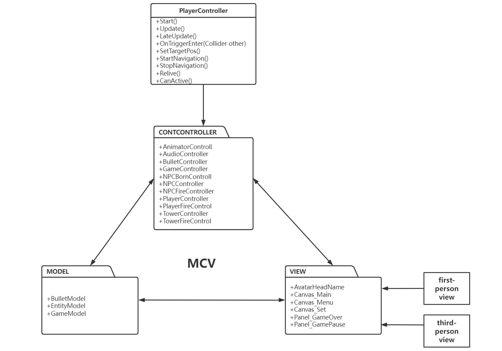

# HERO STRIKE

HERO STRIKE is a beautifully drawn MOBA PVE game where players engage in fierce battles, work with minions to demolish enemy defense towers, and ultimately destroy the enemy's base camp to win the game. The game offers both first-person and third-person views with unique controls for each.

## Game Introduction

### Control Of The Character

#### First-Person View

| Push Buttons       | Description                        |
|--------------------|------------------------------------|
| `W`                | Move forward                       |
| `S`                | Move backwards                     |
| `A`                | Move to the left                   |
| `D`                | Move to the right                  |
| `SPACE`            | Jump                               |
| `Number 1`         | Healing character                  |
| `Number 2`         | Character Skill 1                  |
| `Number 3`         | Character Skill 2                  |
| `Number 4`         | Character Skill 3                  |

#### Third-Person View

| Push Buttons           | Description                        |
|------------------------|------------------------------------|
| `Left mouse button`    | Control character movement         |
| `Number 1`             | Healing character                  |
| `Number 2`             | Character Skill 1                  |
| `Number 3`             | Character Skill 2                  |
| `Number 4`             | Character Skill 3                  |

### Game Rule

- **Map:** The game provides two different maps with the same rules.
- **Death:** After dying, players are resurrected at their base camp to rejoin the battle.
- **Minions:** Minions spawn periodically from both bases, attacking all enemies they encounter and helping players push towards the enemy base.
- **Defense Tower:** Defense towers attack enemies that enter their range, dealing high AOE damage.

### Win and Game Over State

- **Victory Criteria:** Destroy the opponent's base camp to win the game.
- **Failure Criteria:** The game is lost if the heroes' base camp is destroyed.

### Class Diagram

The following diagram represents the class structure of the game:



## Installation and Setup

To get started with HERO STRIKE, follow these steps:

1. **Clone the Repository:**
    ```sh
    git clone https://github.com/yourusername/HERO_STRIKE.git
    cd HERO_STRIKE
    ```

2. **Open in Unity:**
    - Open Unity Hub.
    - Add the project folder you just cloned.
    - Open the project in Unity.

3. **Play the Game:**
    - Press the play button in Unity to start the game.

## Requirements

- Unity 2020.3 or later
- .NET Framework 4.7.1 or later

## License

This project is licensed under the MIT License - see the [LICENSE](LICENSE) file for details.

## Acknowledgments

- Special thanks to the Unity community for their support and resources.
- Thanks to all the contributors for making this game possible.

## Contact

For any inquiries or support, please contact [a@imjyy.com](mailto:a@imjyy.com).

